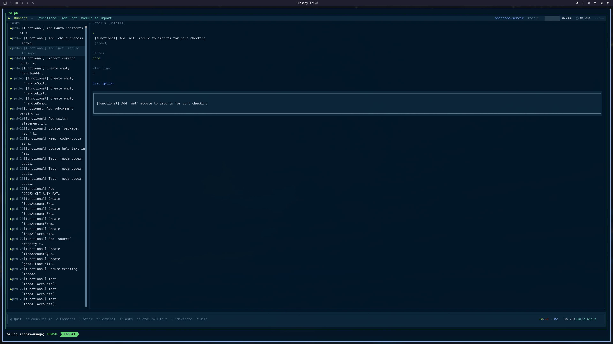
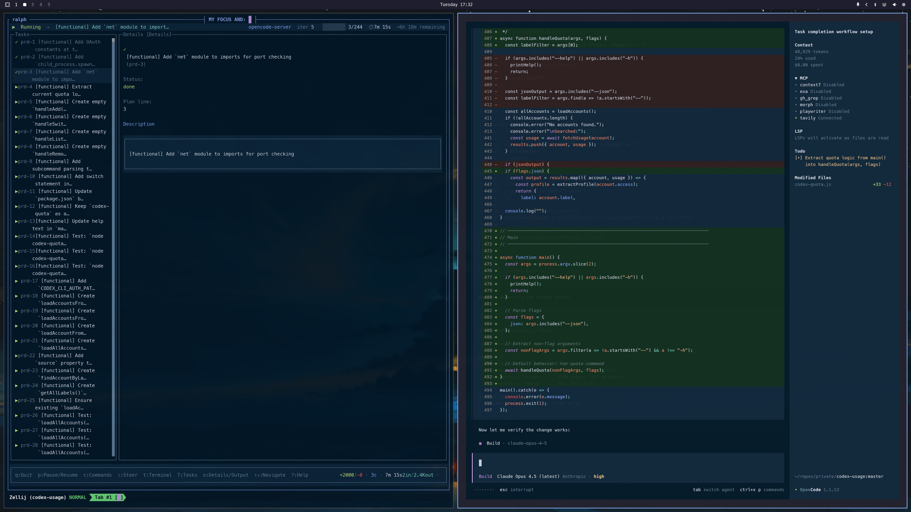

<div align="center">

# OpenRalph

[](https://www.npmjs.com/package/openralph)
[](https://www.npmjs.com/package/openralph)
[](https://opensource.org/licenses/MIT)
[](https://bun.sh)
[](https://www.typescriptlang.org/)

**AI agent loop for autonomous task execution.**

Reads a PRD, picks one task, completes it, commits, repeats.

[Quick Start](#quick-start) •
[Features](#features) •
[Usage](#usage) •
[Config](#configuration) •
[Docs](#writing-prds)

</div>

---

<p align="center">
  
</p>

<p align="center">
  
</p>

<p align="center">
  
</p>

---

## Quick Start

```bash
# Install stable release
bun install -g openralph

# Or install dev snapshot (latest from dev branch)
bun install -g openralph@dev

# Initialize PRD, progress log, and prompt
ralph init

# Run in any project directory
ralph
```

### Install from Source

```bash
git clone https://github.com/shuv1337/openralph.git
cd openralph
bun install
bun run build:single  # compiles for current platform
```

---

## Features

- **Autonomous Task Execution** — AI agent reads your PRD, picks tasks, and completes them one by one
- **Context-Aware Loop** — Re-reads full context every iteration, eliminating context drift
- **Beautiful TUI** — Real-time progress dashboard with task tracking and agent activity logs
- **Multiple Adapters** — Works with OpenCode server, opencode-run, or Codex CLI
- **Headless Mode** — CI-friendly output with JSON/JSONL/text formats
- **Session Safety** — Lock files prevent multiple instances; graceful shutdown with state persistence
- **Smart Resume** — Automatically resumes from where it left off after interruption
- **PRD Conversion** — Convert markdown plans to structured PRD JSON with `ralph init --from`

---

## What is Ralph?

Ralph-driven development forces an AI agent to re-read full context every iteration, eliminating context drift. Each loop:

1. Read `prd.json`
2. Pick ONE task
3. Complete it
4. Commit (updating the PRD in the same commit)
5. Repeat until done

The agent never pushes—only commits—so you maintain review control.

**Why it works:**
- Deterministic failures are debuggable. When Ralph fails, fix the prompt.
- `AGENTS.md` accumulates wisdom so future iterations don't rediscover fire.
- Human review checkpoint before anything goes live.

**Learn more:**
- [ghuntley.com/ralph](https://ghuntley.com/ralph/)
- [lukeparker.dev/stop-chatting-with-ai-start-loops-ralph-driven-development](https://lukeparker.dev/stop-chatting-with-ai-start-loops-ralph-driven-development)

---

## Usage

```bash
ralph                              # uses prd.json in current directory
ralph --plan BACKLOG.json          # different PRD file
ralph --progress progress.txt      # custom progress log
ralph --model anthropic/claude-opus-4  # different model
ralph --reset                      # remove generated files and state, then exit
ralph init --from plan.md          # convert unstructured plan to PRD JSON
```

### CLI Options

| Option | Default | Description |
|--------|---------|-------------|
| `--plan, -p` | `prd.json` | PRD file path |
| `--progress` | `progress.txt` | Progress log path |
| `--model, -m` | `opencode/claude-opus-4-5` | Model (provider/model format) |
| `--adapter` | `opencode-server` | Adapter (opencode-server, opencode-run, codex) |
| `--prompt` | see below | Custom prompt (`{plan}` and `{progress}` placeholders) |
| `--prompt-file` | `.ralph-prompt.md` | Prompt file path |
| `--reset, -r` | `false` | Remove generated files and state, then exit |
| `--headless, -H` | `false` | CI-friendly output |
| `--format` | `text` | Headless output format (text, jsonl, json) |
| `--timestamps` | `false` | Include timestamps in headless output |
| `--max-iterations` | (none) | Cap iterations (headless) |
| `--max-time` | (none) | Cap runtime seconds (headless) |
| `--server, -s` | (none) | OpenCode server URL |
| `--server-timeout` | `5000` | Health check timeout in ms |
| `--agent, -a` | (none) | Agent name (e.g., build/plan/general) |
| `--debug, -d` | `false` | Manual session creation |
| `--yes` | `false` | Auto-confirm prompts |
| `--auto-reset` | `true` | Auto-reset when no TTY prompt |
| `--force` | `false` | Force acquire session lock |
| `--fallback-agent` | (none) | Fallback agent mapping (format: `primary:fallback`) |

### Init Subcommand

```bash
ralph init                    # create template PRD, prompt, plugin, and AGENTS.md
ralph init --from plan.md     # convert markdown plan to PRD JSON
ralph init --force            # overwrite existing files
```

Creates these files:
- `prd.json` — PRD plan file (wrapped format with metadata)
- `progress.txt` — Progress log
- `.ralph-prompt.md` — Prompt template
- `.opencode/plugin/ralph-write-guardrail.ts` — Write guardrail plugin
- `AGENTS.md` — Project configuration for AI agents (never overwritten)
- `.gitignore` entries — Adds Ralph runtime files to .gitignore

| Option | Description |
|--------|-------------|
| `--from` | Source plan or notes to convert into PRD JSON |
| `--force` | Overwrite existing files (except AGENTS.md) |

<details>
<summary><strong>Default Prompt Template</strong></summary>

```
READ all of {plan} and {progress}. Pick ONE task with passes=false (prefer highest-risk/highest-impact). Keep changes small: one logical change per commit. Update {plan} by setting passes=true and adding notes or steps as needed. Append a brief entry to {progress} with what changed and why. Run feedback loops before committing: bun run typecheck, bun test, bun run lint (if missing, note it in {progress} and continue). Commit change (update {plan} in the same commit). ONLY do one task unless GLARINGLY OBVIOUS steps should run together. Quality bar: production code, maintainable, tests when appropriate. If you learn a critical operational detail, update AGENTS.md. When ALL tasks complete, create .ralph-done and output <promise>COMPLETE</promise>. NEVER GIT PUSH. ONLY COMMIT.
```

</details>

---

## Configuration

Ralph reads configuration from `~/.config/ralph/config.json`:

```json
{
  "model": "opencode/claude-opus-4-5",
  "plan": "prd.json",
  "progress": "progress.txt",
  "adapter": "opencode-server",
  "server": "http://localhost:4190",
  "serverTimeout": 5000
}
```

CLI arguments override config file values.

### Environment Variables

| Variable | Description |
|----------|-------------|
| `RALPH_MODEL` | Override model |
| `RALPH_ADAPTER` | Override adapter |
| `RALPH_PLAN` | Override plan file path |
| `RALPH_PROGRESS` | Override progress log path |
| `RALPH_SERVER` | Override OpenCode server URL |

### Safety & Reliability

- **Session Locking** — Prevents multiple Ralph instances from running in the same directory
- **Error Backoff** — Retries failed agent iterations with exponential backoff
- **Graceful Shutdown** — Double Ctrl+C for force quit, single for confirmed exit

### Adapters

| Adapter | Description |
|---------|-------------|
| `opencode-server` | Default. Connects to OpenCode server via SDK |
| `opencode-run` | Spawns `opencode run` as PTY subprocess |
| `codex` | Spawns OpenAI Codex CLI as PTY subprocess |

---

## Writing PRDs

Prefer PRD JSON with `passes` flags so Ralph can track scope and progress. Two formats are supported:

**Plain array (user-created):**
```json
[
  {
    "category": "functional",
    "description": "Create the CLI entry point",
    "steps": [
      "Run the CLI with --help",
      "Verify the help output renders"
    ],
    "passes": false
  }
]
```

**Wrapped format (generated by `ralph init`):**
```json
{
  "metadata": {
    "generated": true,
    "generator": "ralph-init",
    "createdAt": "2025-01-13T00:00:00.000Z",
    "sourceFile": "plan.md"
  },
  "items": [
    {
      "category": "functional",
      "description": "Create the CLI entry point",
      "passes": false
    }
  ]
}
```

**Tips:**
- Small, isolated tasks — one commit each
- Explicit verification steps
- Set `passes` to true only when verified
- 1000+ lines is normal; more detail = fewer hallucinations
- Legacy markdown checkboxes work too, but `ralph init --from plan.md` is the upgrade path

---

## Workflow Files

| File | Purpose |
|------|---------|
| `prd.json` | PRD plan items with `passes` state |
| `progress.txt` | Progress log appended each iteration |
| `.ralph-prompt.md` | Prompt template used for loop runs |
| `.ralph-state.json` | Persisted state for resume after Ctrl+C |
| `.ralph-lock` | Prevents multiple instances |
| `.ralph-done` | Agent creates this when all tasks complete |
| `.ralph-pause` | Created by `p` key to pause loop |
| `.opencode/plugin/ralph-write-guardrail.ts` | Protects files from AI modification |
| `AGENTS.md` | Project configuration for AI agents |

Add to `.gitignore`:
```
.ralph-*
```

### Progress Log Example

```
## Iteration 3 - 2025-01-10T12:34:56Z
- Task: Wire up API client
- Checks: typecheck, test
- Commit: abc123
- Notes: Added retry logic for timeouts
```

### AGENTS.md

Ralph writes operational learnings here. Future iterations read it.

```markdown
# AGENTS.md

## Build
- Run `bun install` before `bun run dev`

## Pitfalls
- Never import from `solid-js`, use `@opentui/solid`
```

---

## Keybindings

| Key | Action |
|-----|--------|
| `q` / `Ctrl+C` | Quit (shows confirmation) |
| `Ctrl+C` (double) | Force quit |
| `p` | Pause/Resume loop |
| `c` | Open command palette |
| `:` | Steering mode (send message to agent) |
| `t` | Launch terminal with attach command |
| `Shift+T` | Toggle tasks panel |
| `Shift+C` | Toggle completed tasks / Copy attach command |
| `o` | Toggle Details/Output view |
| `d` | Toggle progress dashboard |
| `?` | Show help overlay |
| `↑` / `k` | Navigate up (in tasks panel) |
| `↓` / `j` | Navigate down (in tasks panel) |
| `n` | New session (debug mode only) |
| `Escape` | Close overlay/panel |

---

## Architecture

```
src/
├── index.ts          # CLI entry, wires TUI to loop
├── loop.ts           # Main agent loop (prompt → events → commit)
├── app.tsx           # Solid.js TUI root component
├── state.ts          # State types and persistence
├── plan.ts           # PRD + markdown plan parser
├── git.ts            # Git operations (hash, diff, commits)
├── prompt.ts         # User confirmation prompts
├── adapters/         # Adapter implementations (opencode, codex)
├── components/       # TUI components (header, log, footer, panels)
├── context/          # React-style contexts (theme, dialog, toast)
├── hooks/            # Custom hooks (keyboard, loop state, stats)
├── lib/              # Core utilities (config, logging, theming, time)
├── pty/              # PTY subprocess management
├── templates/        # Init templates (agents, plugins)
├── types/            # TypeScript type definitions
└── ui/               # Dialog components
```

**Data flow:** `index.ts` starts the TUI (`app.tsx`) and the loop (`loop.ts`) in parallel. The loop sends callbacks to update TUI state. State persists to `.ralph-state.json` for resume capability.

---

## Testing

```bash
bun test              # run all tests
bun test --watch      # watch mode
bun test --coverage   # with coverage
```

```
tests/
├── unit/         # Module isolation tests
├── integration/  # Full workflow tests
├── fixtures/     # Test plans and PRD JSON
└── helpers/      # Mock factories, temp file utils
```

---

## Requirements

- [Bun](https://bun.sh) v1.0+
- [OpenCode](https://opencode.ai) CLI running (or alternative adapter)

---

## Contributing

Contributions are welcome! Feel free to submit a Pull Request.

1. Fork the repo
2. Create your feature branch (`git checkout -b feature/cool-stuff`)
3. Commit your changes (`git commit -m 'Add cool stuff'`)
4. Push to the branch (`git push origin feature/cool-stuff`)
5. Open a Pull Request

---

## Credits

- Thanks to [Geoffrey Huntley](https://ghuntley.com) for the original Ralph Wiggum loop concept
- OpenRalph is a fork of [`opencode-ralph`](https://github.com/hona/opencode-ralph) — huge thanks to [Hona](https://github.com/hona) for the original implementation

---

## License

MIT License - see [LICENSE](LICENSE) for details.

---

<div align="center">

Made by the ralph development community

</div>
